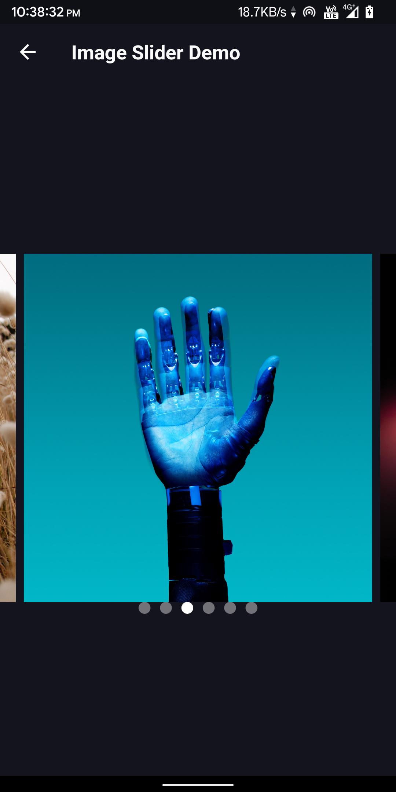
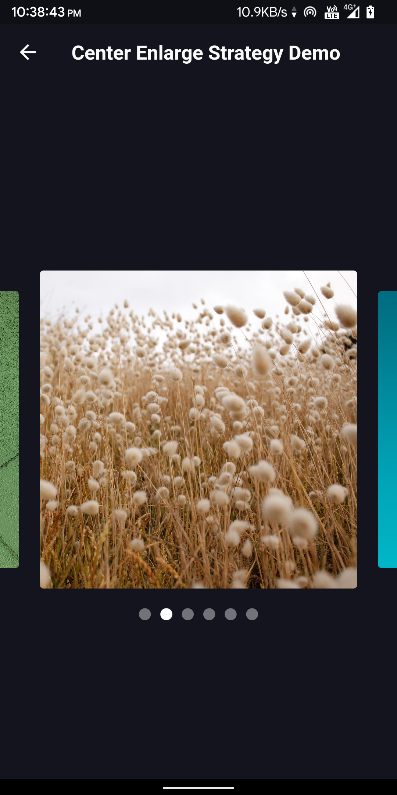
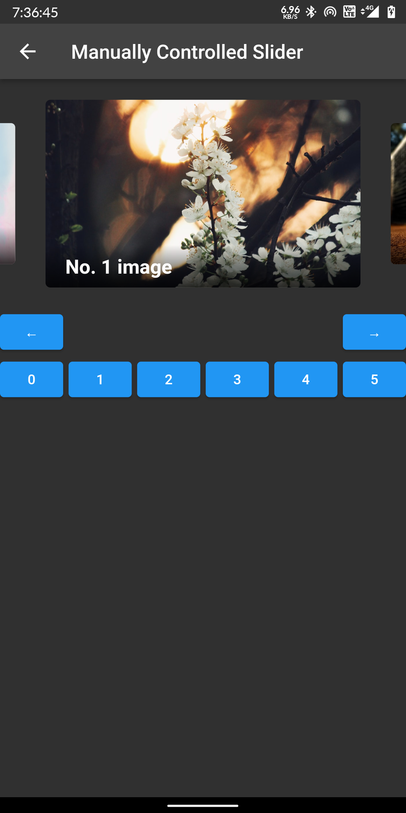
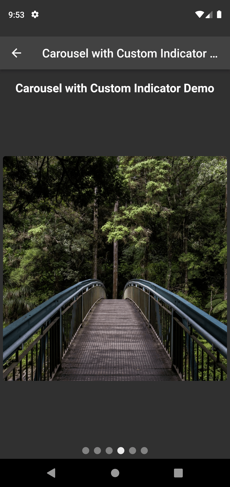
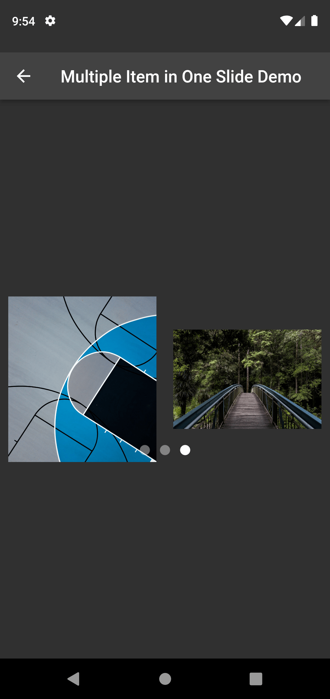

# flutter_carousel_widget

A customizable carousel slider widget in Flutter which supports infinite scrolling, auto scrolling,
custom child widget, custom animations and pre-built indicators.

[][pub]
[](https://pub.dev/packages/flutter_carousel_widget/score)
[](https://pub.dev/packages/flutter_carousel_widget/score)
[](https://pub.dev/packages/flutter_carousel_widget/score)

## Features

* Infinite Scroll
* Custom Child Widget
* Auto Play
* Horizontal and Vertical Alignment
* Pre-built carousel Indicator.
* Many more features are coming soon

## Installation

Add `flutter_carousel_widget` as a dependency in your `pubspec.yaml` file:

```dart
dependencies:
flutter_carousel_widget: ^0.1.5
```

And import it:

```dart
import 'package:flutter_carousel_widget/flutter_carousel_widget.dart';
```

## Usage

Simply create a `FlutterCarousel` widget, and pass the required params:

```dart
FlutterCarousel(
  options: CarouselOptions(
    height: 400.0, 
    showIndicator: true,
    slideIndicator: CircularSlideIndicator(),
  ),
  items: [1,2,3,4,5].map((i) {
    return Builder(
      builder: (BuildContext context) {
        return Container(
          width: MediaQuery.of(context).size.width,
          margin: EdgeInsets.symmetric(horizontal: 5.0),
          decoration: BoxDecoration(
            color: Colors.amber
          ),
          child: Text('text $i', style: TextStyle(fontSize: 16.0),)
        );
      },
    );
  }).toList(),
)
```

### Option Customization

```dart
FlutterCarousel(
   items: items,
   options: CarouselOptions(
      height: 400,
      aspectRatio: 16/9,
      viewportFraction: 0.8,
      initialPage: 0,
      enableInfiniteScroll: true,
      reverse: false,
      autoPlay: true,
      autoPlayInterval: Duration(seconds: 3),
      autoPlayAnimationDuration: Duration(milliseconds: 800),
      autoPlayCurve: Curves.fastOutSlowIn,
      enlargeCenterPage: true,
      onPageChanged: callbackFunction,
      scrollDirection: Axis.horizontal,
      showIndicator: true,
      slideIndicator: CircularSlideIndicator(),
   )
 )
```

### Build item widgets on demand

This method will save memory by building items once it becomes necessary. This way they won't be
built if they're not currently meant to be visible on screen. It can be used to build different
child item widgets related to content or by item index.

```dart
FlutterCarousel.builder(
  itemCount: 15,
  itemBuilder: (BuildContext context, int itemIndex, int pageViewIndex) =>
    Container(
      child: Text(itemIndex.toString()),
    ),
)
```

## Carousel controller

In order to manually control the pageview's position, you can create your own `CarouselController`,
and pass it to `CarouselSlider`. Then you can use the `CarouselController` instance to manipulate
the position.

```dart 
class CarouselDemo extends StatelessWidget {
  CarouselController buttonCarouselController = CarouselController();

 @override
  Widget build(BuildContext context) => Column(
    children: <Widget>[
      FlutterCarousel(
        items: child,
        carouselController: buttonCarouselController,
        options: CarouselOptions(
          autoPlay: false,
          enlargeCenterPage: true,
          viewportFraction: 0.9,
          aspectRatio: 2.0,
          initialPage: 2,
        ),
      ),
      RaisedButton(
        onPressed: () => buttonCarouselController.nextPage(
            duration: Duration(milliseconds: 300), curve: Curves.linear),
        child: Text('→'),
      )
    ]
  );
}
```

### `CarouselController` methods

#### `.nextPage({Duration duration, Curve curve})`

Animate to the next page

#### `.previousPage({Duration duration, Curve curve})`

Animate to the previous page

#### `.jumpToPage(int page)`

Jump to the given page.

#### `.animateToPage(int page, {Duration duration, Curve curve})`

Animate to the given page.

## Screenshots

Basic Flutter Carousel:



Enlarge Center Widget Flutter Carousel:



Fullscreen Flutter Carousel:


Manually Controlled Flutter Carousel:



Flutter Carousel with custom indicator:



Flutter Carousel with multiple item in one widget:



## Credits

This package is initially inspired from [carousel_slider][carousel_slider] package.
Thanks [serenader.me][serenader] for the package. I am extending this package with some extra
toppings and new features.

## Connect With Me

[][website]

[][github]

[][instagram]

[][facebook]

[][twitter]

[][linkedin]

[pub]: https://pub.dev/packages/flutter_carousel_widget

[github]: https://github.com/nixrajput

[website]: https://nixlab.co.in

[facebook]: https://facebook.com/nixrajput07

[twitter]: https://twitter.com/nixrajput07

[instagram]: https://instagram.com/nixrajput

[linkedin]: https://linkedin.com/in/nixrajput

[carousel_slider]: https://pub.dev/packages/carousel_slider

[serenader]: https://pub.dev/publishers/serenader.me/packages